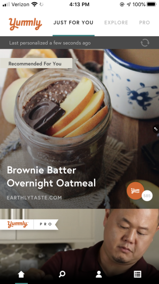
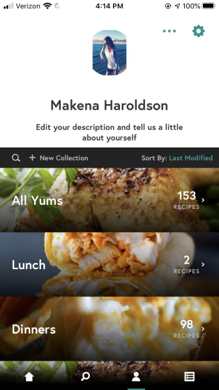
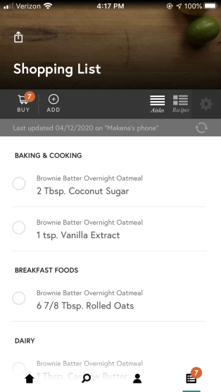

# Yummly Application
*By Makena Haroldson*
*4/12/2020*

### Images

    (1) 
    

    (2) 
    

    (3) 
    

    (4) 
    

### My Experience

Due to the current situation of staying home and having online classes, I have more time to prepare my meals. Instead of rushing out the door spreading some cream cheese on a bagel, I can now enjoy a nice omelet. For lunch, instead of having a bare turkey and cheese sandwich while trying to sneak some in bites during class, I can go downstairs to whip up something and then eat it on the couch while watching my teachers explain Bootstrap Distribution. Because I have more time to make food, I wanted a way to find and organize different recipes.

I came across an application called Yummly that is great for discovering different dishes, personalized to my taste. After making an account and putting in my food preferences and skill level, I was directed to the main page shown in the picture (1). I think Yummly accomplishes the usability goal of **learnable** as it was easy learning the ways to navigate through the app. On the home page, I am able to scroll through(swipe up) to go through the different recipes that I would possibly enjoy. If I liked something and wanted to save it, I can click on the "yum" button which responds with good **feedback** as the button would then turn white and the words "yum" appear on the screen. When clicking on a specific recipe, its picture becomes enlarged and if I scroll down, the ingredients, a button to show the directions, and people's reviews are shown.

Along with giving user's a variety of ways to discover new recipes, including the explore page (2) and a search page, the application is **effective** as it allows one to categorize their saved recipes into self-made "collections" (3). Through this, I can easily find my recipes based on different courses. If I wanted to remove an item from my general "yum" however it is saved another collection, take Lunch, for example, collections, a message pops up asking "Are you sure you want to remove this recipe from your Yums?". This is a great **error tolerant** feature that prevents users from making the mistake of losing a saved recipe in which they would then have to find again. Another element of the application that allows users to successfully carry their task of preparing a meal is Yummly's shopping list (4). If I select a recipe, there is an option to add all the ingredients for it to my shopping list. Then on the shopping list page, I can cross out each item as I am actually shopping at the store.

Overall, Yummly is a **useful** application that helps users discover new recipes and collect the needed ingredients to have a great meal. I think the only critique that I have is on the placement of the profile/collection page. In the lower navigation bar, instead of having it at the left of the shopping list icon, I would rather have it placed on the right. The reason is that I am so used to having the profile on the far left of the navigation bar due to social media application, I always mistakenly click on the shopping list page.

[Return](../)