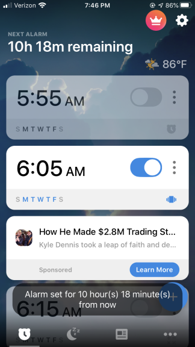
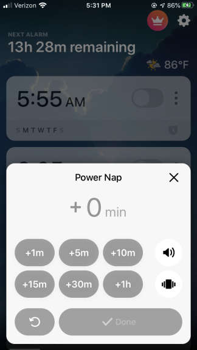
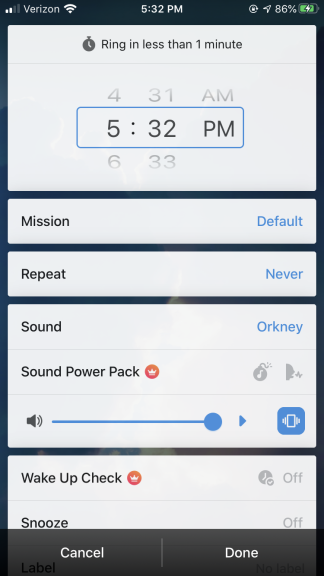
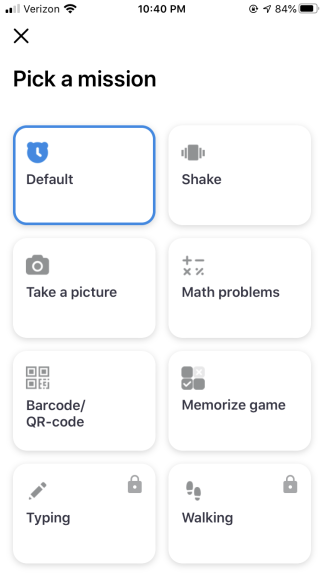

# Alarmy Application
*By Makena Haroldson*
*5/10/2020*

### Images

    (1) 
    

    (2) 
    

    (3) 
    

    (4) 
    

### My Experience

I have always had a hard time waking up in the morning due to the pure need of wanting more sleep. Because I am one of those people that has 5 alarms set that go off every 10 minutes, I wanted a better way of waking up successfully. Last year, I found application on the app store called Alarmy which some great features in helping me wake up.

When opening the application it directs me to the home page which shows all the alarms I have made (1). First of all, by giving users a big switch that highlights the alarm when turned on or gives the alarm transparency when turned off, the users receive great **feedback** from the application. Also, through its thorough icons and labels, the application accomplishes the usability goals of being **learnable** and also **memorable**. From its visible and understandable blue add/plus button, I am easily reminded where to make an alarm. Once clicking on the button, the app shows only two options of "Power Nap" and "Alarm" which makes it clear what different alarms it can do. When I want to take a power nap after a long day of school, the app allows me to increment my preferred nap with fixed times, shown using + and adding an "m" or "h" to show the times units (2). On the other hand, to make a regular alarm, there are only a few options for me to choose from with recognizable features that I have already seen before in other apps, such as scrolling through the hours and minutes of the alarm (3). Overall, due to the simplicity of options and well thought descriptive labels, I am able to easily learn and remember the functions of the application's interface.

With Alarmy's features of a regular alarm, including a snooze button and loud ringtone, the app gives me the option to carry out different "missions" to turn off the alarm (4). The missions range from solving a set of math problems(users are able to choose level of difficulty), to taking a picture or shaking their phone a number of times, and only by successfully accomplishing the task I can dismiss the alarm. By giving user these tasks, the application is not only **useful** by waking one up, but it is also **effective** as it forces a user to wake up through the stimulation of their brain from the missions.

In the end, personally, I can say that using Alarmy is **satisfying** as I am glad, yet reluctant, that I can wake up on time for school and that I can do fast two-digit addition.

[Return](../)